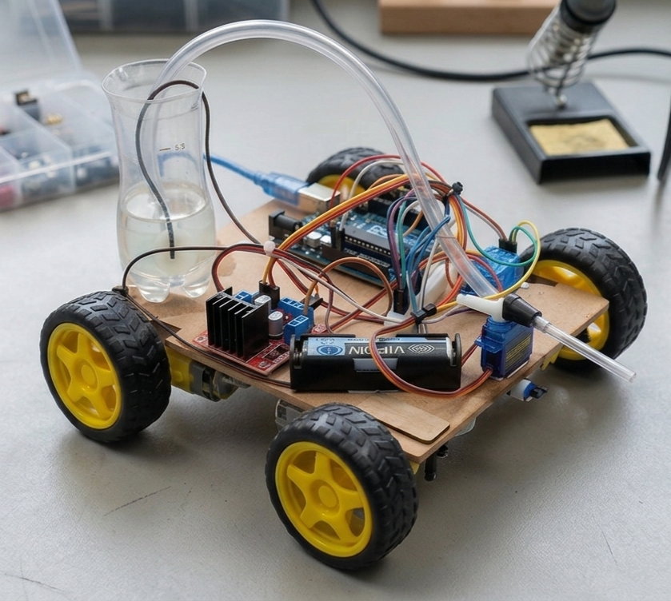
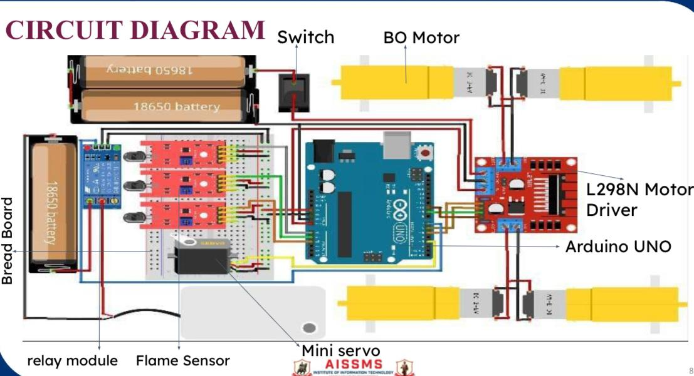

# 🔥  Autonomous Fire-Fighting Robot using Arduino

An autonomous Arduino-based fire-fighting robot designed to detect and respond to fire in real time using multi-directional flame sensing. The system integrates motor-driven navigation and a servo-controlled water spraying mechanism to approach and extinguish the fire source without human intervention, demonstrating practical implementation of embedded systems and robotics.

---

## 📌 Overview

This project presents the design and development of an autonomous fire-fighting robot using Arduino.

The robot detects fire from multiple directions using flame sensors and moves toward the source automatically. Based on sensor input, it adjusts its direction (left, center, or right) using motor control.

Once the robot reaches the fire, it stops and activates a water pump through a relay module. A servo motor is used to sweep the nozzle, ensuring better water coverage and effective fire suppression.

This project demonstrates the practical application of embedded systems, automation, and robotics in building a responsive safety system.

---

## ⚙️Key Features

- 🔥 Multi-directional fire detection (Left, Center, Right)
- 🚗 Autonomous movement towards fire
- 💧 Automatic water spraying system
- 🎯 Servo-based directional control for accurate targeting
- ⚡ Real-time response without human intervention

---

## 🛠️ Components Used

- Arduino Uno  
- Flame Sensors (3x)  
- L298N Motor Driver  
- BO Motors & Wheels  
- Relay Module  
- Water Pump  
- Servo Motor  
- Breadboard & Jumper Wires  
- Power Supply  

---

## 🧠 Working Principle

1. The flame sensors continuously detect infrared radiation from fire.
2. Based on sensor values, the robot determines the direction of fire.
3. Motors drive the robot toward the detected fire source.
4. Once close, the robot stops and activates the water pump.
5. The servo motor sweeps to spread water and extinguish the fire.

---

## 📁 Project Structure

fire-fighting-robot/

- fire_robot.ino  
- README.md  
- images/  
  - Robot.png  
  - Circuit_Diagram.jpg  
- docs/  
  - fire-fighting-robot-research-paper.pdf 

---

## 🖼️ Project Images

  
  

---

## 📄 Documentation

This project also includes a detailed study and analysis of the system.

👉 [View Research Paper](docs/fire-fighting-robot-research-paper.pdf)

---

## 🚀 Future Improvements

- Add obstacle avoidance system  
- Integrate wireless control (Bluetooth/WiFi)  
- Improve fire detection accuracy  
- Add temperature and gas sensors  

---

## 👨‍💻 Author

**Ayush Khot**

---

## ⭐ If you like this project

Give it a ⭐ on GitHub and feel free to explore or improve it!